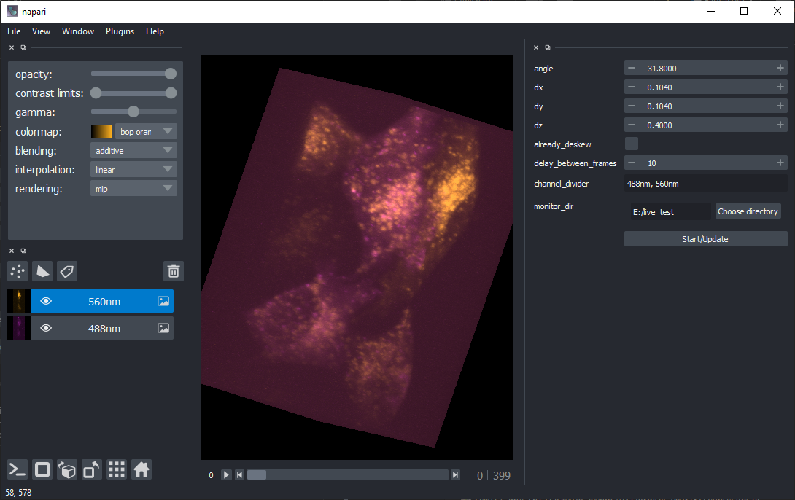
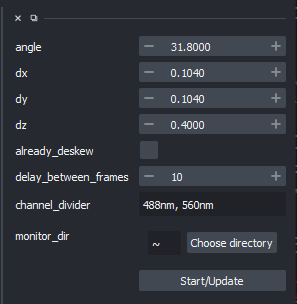

# How to
> The assumption : Data is time series "tif" files where one file is volume/z-stack, and the file names are alphanumerically sorted.

# Install

Download this repository

You can clone this repository
```
git clone https://github.com/zeroth/LiveViewerLLSM-Napari.git
```
Or download the zip [here](https://github.com/zeroth/LiveViewerLLSM-Napari/archive/main.zip)

```
cd LiveViewerLLSM-Napari
pip install -r requirements.txt
```

# Run

```
python main.py
```
Once you have launched the `main.py` script, You will see napari with a new dialog box on the right.



# Lattice Light-Sheet Microscope (LLSM) configuration

configure the LLMS parameters in the dialog


Parameter    | Description
------------ | -------------
`angle` | the acquisition angle of LLSM
`dx` | is X pixel size in &micro;m
`dy` | is Y pixel size in &micro;m
`dz` | is Z Step size in &micro;m
`delay_between_frames` | is acquisition delay between every volume in sec.
`already_deskew` | if you have pre-deskewed data which you just want to visualize it then check this box.
`channel_divider` | comma-separated unique text values from your file name which identifies the channel(s). If you have a single channel and/or you don't want to separate channel layers set this to `*`. example if your file names are `cell05_CamA_ch1_stack0000_560nm_0000000msec_0608651426msecAbs.tif` `cell05_CamB_ch0_stack0116_488nm_0585789msec_0609237215msecAbs.tif` then the value can be `CamB, CamA` or `560nm, 488nm` 
`monitor_dir` | set this to your acquisition directory

After setting the configuration, click on the `Start/Update` button. 

If you misconfigure after clicking `Start/Update` don't worry, just update the setting and click `Start/Update` again.
